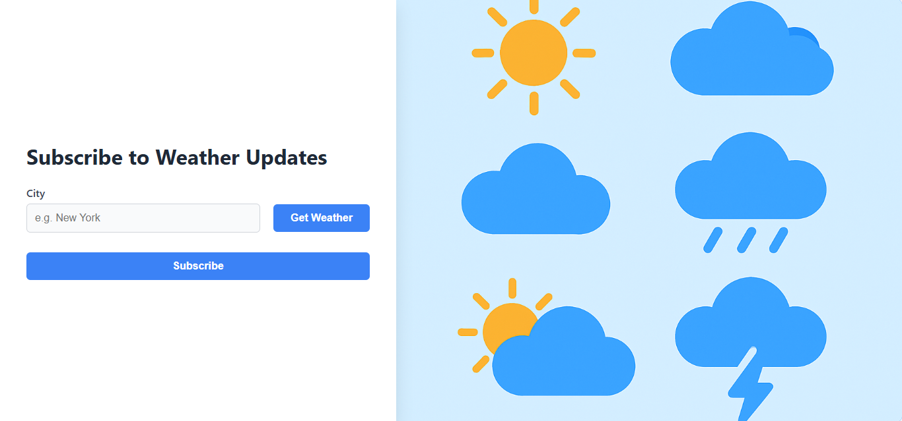

# 🌦️ WeatherNet Application

A Docker-based web application for monitoring weather data.



All media files can be found in the `/media` folder located in the root directory of the project.

---

## 🚀 Setup Instructions

### 🔧 Development Environment

1. **Create environment configuration files**:
    - Copy `.env.example` to `.env` for each service:
      ```bash
      cp infra/dev/php/.env.example infra/dev/php/.env
      cp infra/dev/postgres/.env.example infra/dev/postgres/.env
      ```

2. **(Optional) Customize database settings**:

   In `infra/dev/postgres/.env`:
   ```env
   POSTGRES_DB=your_database_name
   POSTGRES_USER=your_username
   POSTGRES_PASSWORD=your_password
   ```

   In `infra/dev/php/.env`, set the DB config to match:
   ```env
   DB_DATABASE=your_database_name
   DB_USERNAME=your_username
   DB_PASSWORD=your_password
   
   WEATHER_API_KEY=weather_api_key_is_here
   ```

3. **Run the application**:
   ```bash
   cd infra/dev
   docker compose up --build
   ```

4. Open your browser and go to: [http://localhost:8088](http://localhost:8088)

---

### 🏗️ Production Environment

1. **Create environment configuration files**:
    - Copy `.env.example` to `.env` for each service:
      ```bash
      cp infra/prod/php/.env.example infra/prod/php/.env
      cp infra/prod/postgres/.env.example infra/prod/postgres/.env
      ```

2. **(Optional) Customize database settings**:

   In `infra/prod/postgres/.env`:
   ```env
   POSTGRES_DB=your_database_name
   POSTGRES_USER=your_username
   POSTGRES_PASSWORD=your_password
   ```

   In `infra/prod/php/.env`, set the DB config to match:
   ```env
   DB_DATABASE=your_database_name
   DB_USERNAME=your_username
   DB_PASSWORD=your_password
   
   WEATHER_API_KEY=weather_api_key_is_here
   ```

3. **Run the application in production-like mode** (no bind mounts for real-time code updates):
   ```bash
   cd infra/prod
   docker compose up --build
   ```

4. Open your browser and go to: [http://localhost:8088](http://localhost:8088)

5. You will se the following page:
---

## ✅ Prerequisites

- [Docker](https://www.docker.com/) & [Docker Compose](https://docs.docker.com/compose/)
- Access to ports `8088` and `5432` on your machine

---

## Author Notes

## API Documentation

OpenAPI documentation for the implemented API is available in the `openapi.yaml` file. This documentation provides a comprehensive reference for all endpoints, request parameters, and response formats.

### API Design Considerations

* **City Validation**: The system checks if a city exists before subscribing a user to ensure data integrity.
* **Error Handling**:
   * For validation errors, HTTP 400 codes are used (rather than 422) to maintain consistency with the original API specification provided in the task description.
   * HTTP 502 Bad Gateway codes are implemented when WeatherAPI access fails during weather retrieval or subscription processes.
   * Throughout the API, detailed error messages are provided to facilitate debugging and improve user experience.
* **Token Management**: Confirmation token and cancellation token are designed to be different. 
  * Confirmation token expire within 24 hours, cancellation token do not have expiration time. When a user requests the same subscription again (same combination of email, city, and frequency):
  * If the previous confirmation token hasn't expired: No new subscription record is created; the user is informed they need to check their email inbox for the confirmation link. 
  * If the previous confirmation token has expired: The system updates the confirmation token rather than creating a new subscription record.

## Testing the Application

### API Testing
You can test the API using either:
* Swagger integration in PHPStorm
* Postman (import the OpenAPI definition)

### Web Interface
Open the application in your browser to experience the complete user flow.

## Redis Queue Implementation

Redis is utilized as a message queue with a delayed job mechanism to manage email schedules. Key features:

* **User-Specific Timing**: Each user's notification schedule is based on their subscription confirmation time.
* **Subscription Status Checks**: Before sending any scheduled email, the system verifies the current subscription status. If a user has cancelled their subscription, pending emails will not be sent even if they were previously scheduled.
* **Chained Scheduling**: Each email delivery automatically schedules the next one, creating a continuous chain of notifications based on the user's selected frequency.

## Email Testing

The application uses Mailpit for email testing:
* **Access the mail client**: [http://localhost:8025](http://localhost:8025)
* **Testing Tip**: For quicker testing, you can modify frequency intervals in the database (using Adminer at [http://localhost:8083](http://localhost:8083)). For example, changing an interval to 2 minutes allows you to observe emails being sent at this shorter interval after subscription confirmation.

## Weather API Integration

To use the Weather API functionality:
1. Create an account at [WeatherAPI](https://www.weatherapi.com/my)
2. Obtain your API token
3. Add the token to the appropriate `.env` files as described at the beginning of this README
